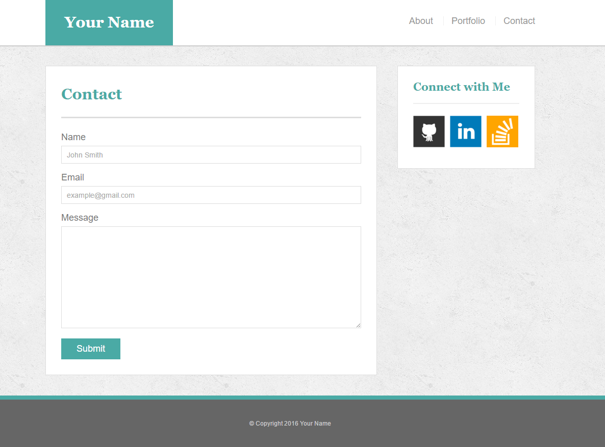
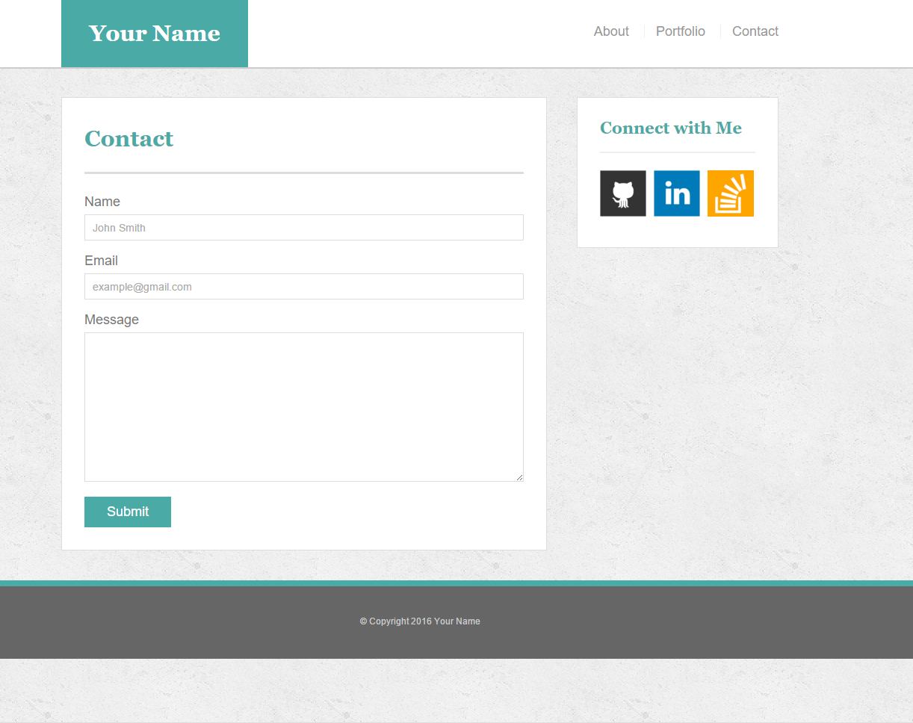

### Basic portfolio project

In this assignment, I build a professional portfolio site using HTML/CSS following the specs provided in class (see screenshots). I use [GitHub Pages](https://aliciawyse.github.io/my_basic_portfolio/) to showcase my work. 

   

   

   

   
   
   